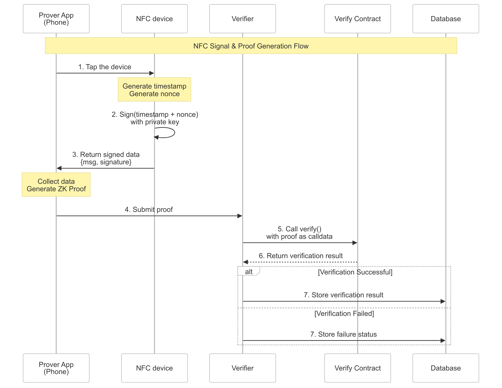

# Proof of Attendance
The idea comes from the hackathon of Invisible Garden.

We use zkp to achieve automatically everyday check-in process for the participants and still keep the privacy of the sensitive information.

# Technical Architecture
The technical architecture is as follows:



# usage

## 1. install dependencies
```
yarn 
```

## 2. compile the circuit and setup verification process
```
./setup.sh
```
all the files will be generated in the build folder.

## 3. export the verifier.sol and deploy it to the chain
```
forge create --rpc-url $YOUR_RPC_URL --private-key $YOUR_PRIVATE_KEY --etherscan-api-key $YOUR_ETHERSCAN_API_KEY contracts/verifier.sol:Groth16Verifier
```

## 4. start the nfc-device-simulator and server
```
cd nfc-device-simulator
yarn start
```

```
cd ../server
go run main.go
```

## 5. interact with the nfc-device-simulator to generate the proof
```
./tap-nfc-generate-proof.sh
```

## 6. verify the proof and record the attendance
```
./verify-and-record.sh
```


